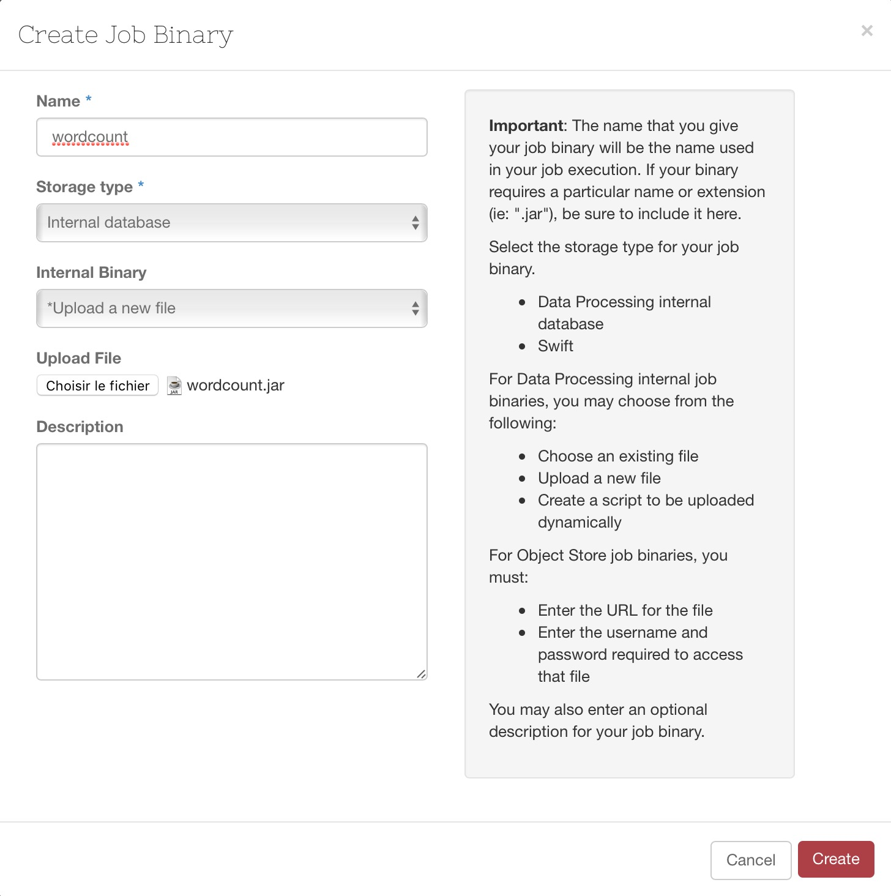
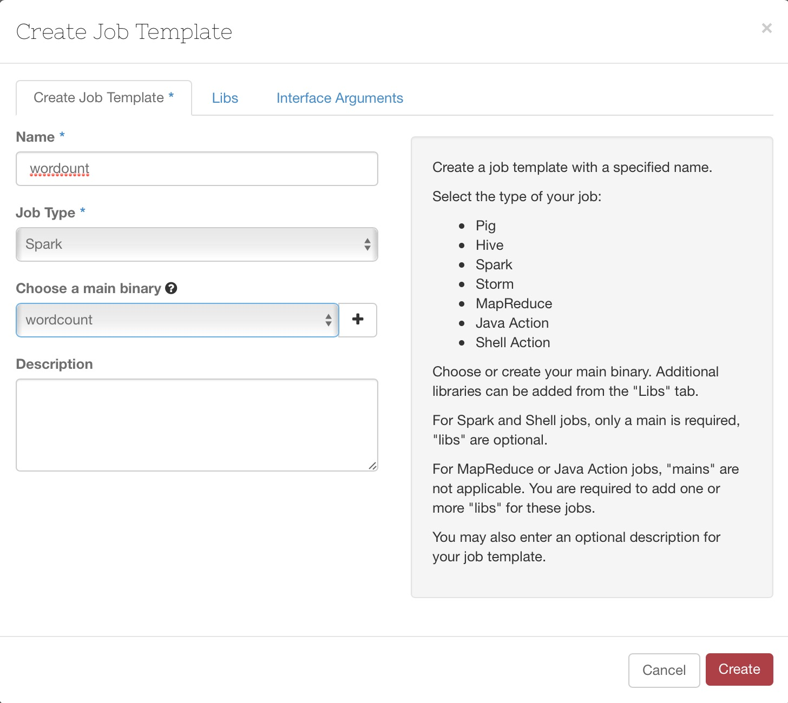
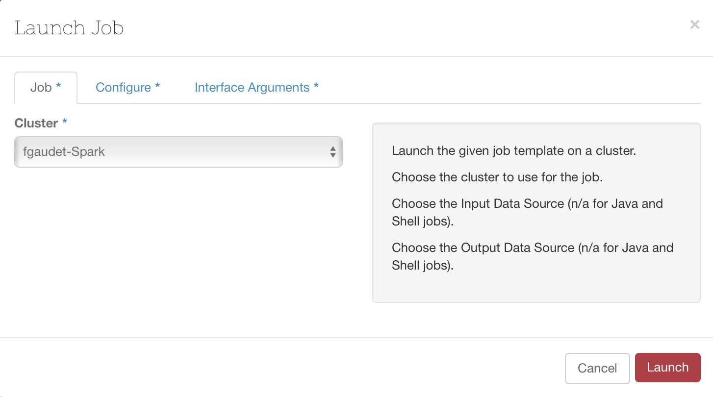
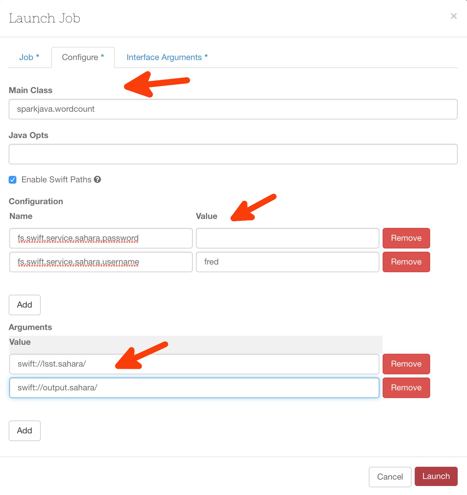
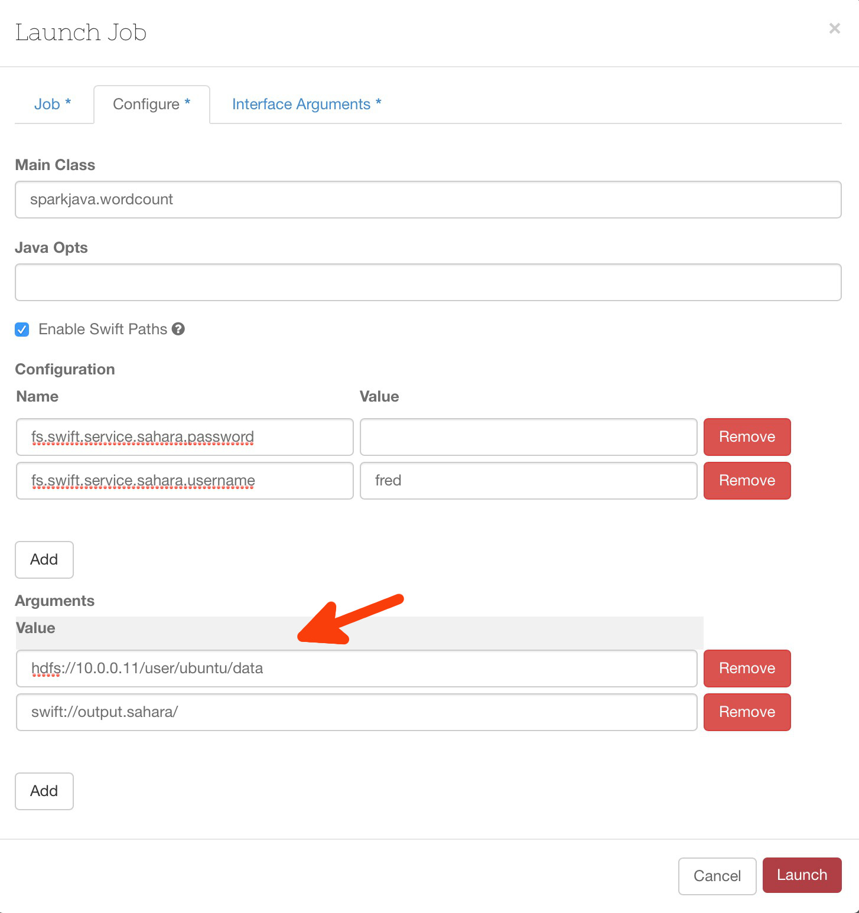

# Introduction

Maintenant que notre cluster est opérationnel, nous allons y lancer un traitement. Le processus de création des jobs est le suivant :


graph LR;
  A(Stockage du binaire)-->B;
  B(Définition du modèle de job)-->C;
  C(Lancement du job);


# Stockage des binaires

Ouvrez le menu EDP, puis 'Job binaries'. Cliquez sur 'Create Job binary'

Choisissez soit un binaire à uploader, soit une URL swift. Cliquez sur 'Create'.

Notre binaire est maintenant enregistré :

# Définition du modèle de job

Le modèle de job spécifie les binaires à utiliser. Cliquez sur 'Create Job Template'

 Le binaire principal est à renseigner dans l'onglet 'Create job template', et éventuellement des librairies supplémentaires à définir dans l'onglet 'Libs'.

Par exemple pour un job Spark :

Cliquez sur 'Create'.

# Lancement du job

A partir du job template, cliquez sur 'Launch on existing cluster'. 

Les champs à renseigner ensuite dépendent du type d'exécutable que vous souhaitez utiliser. Dans l'exemple donné ci-dessous, j'utilise un jar Spark qui nécessite 2 arguments en entrée : un chemin vers les données et un chemin vers lequel le résultat sera écrit. Les données sont stockées sur l'Object Store.

 Quelques explications :

 * Main class : classe principale qui sera appelée,

**Section configuration :**

 * Username Swift : notez que le nom de la variable 'fs.swift.service.sahara.username' est immuable
 * Password Swift : le nom de la variable doit également être respecté.

Tous les couples name/value de la section configuration vont être placés dans le fichier core-site.xml du master.

**Section Arguments :**

* Un champs pour le premier argument à fournir au jar,
* Un champs pour le second argument à fournir au jar.

Attention, le container de sortie ne doit pas exister avant de lancer le job.

Si les données se trouvent sur HDFS, il suffit de changer l'URI correspondante :

Cliquez sur 'Launch'. Le job va s'exécuter sur le cluster :

